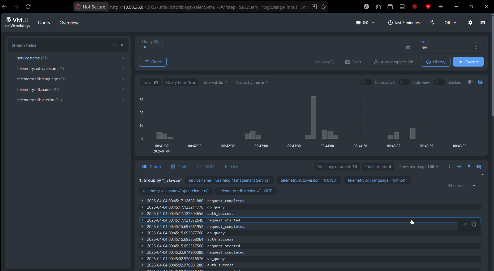
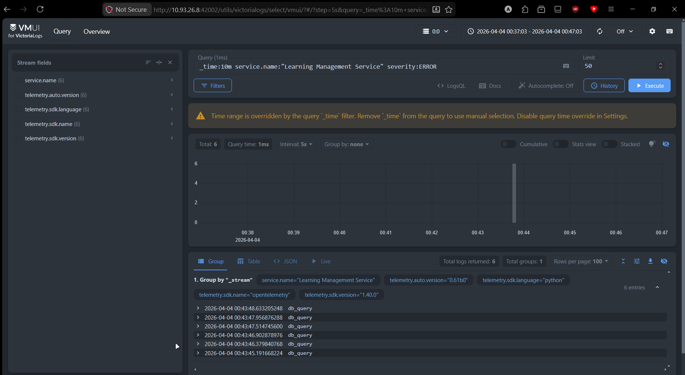
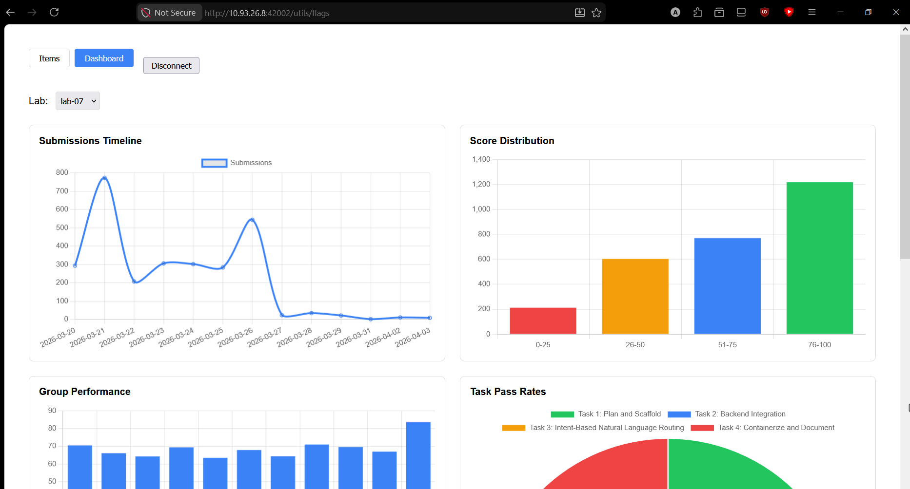

# Lab 8 — Report

Paste your checkpoint evidence below. Add screenshots as image files in the repo and reference them with ``.

## Task 1A — Bare agent

**"What is the agentic loop?"**

```
The **agentic loop** is the iterative cycle that enables an AI agent to act autonomously:

1. **Reason** — Analyze the current state and decide the next step.
2. **Act** — Execute a tool or action (e.g., run code, search the web).
3. **Observe** — Receive the result or feedback from that action.
4. **Repeat** — Loop back to reasoning until the goal is met.

This cycle allows agents to break down complex tasks, adapt to new information, and self-correct, rather than just producing a single static response.
```

**"What labs are available in our LMS?"**

At this stage the agent has no MCP tools configured yet (or uses only local file inspection). It cannot return real backend data — it may say it doesn't know, or it may inspect local repo files and answer from documentation instead of the live LMS.

<!-- TODO: Run this AFTER removing MCP config to capture the bare-agent response:
cd nanobot && uv run nanobot agent --logs --session cli:task1a-labs -c ./config.json -m "What labs are available in our LMS?"
Paste the actual response here.
-->

## Task 1B — Agent with LMS tools

**"What labs are available?"**

```
Here are the labs available in your LMS:

| ID     | Title                                          |
|--------|------------------------------------------------|
| Lab 01 | Products, Architecture & Roles                 |
| Lab 02 | Run, Fix, and Deploy a Backend Service         |
| Lab 03 | Backend API: Explore, Debug, Implement, Deploy |
| Lab 04 | Testing, Front-end, and AI Agents              |
| Lab 05 | Data Pipeline and Analytics Dashboard          |
| Lab 06 | Build Your Own Agent                           |
| Lab 07 | Build a Client with an AI Coding Agent         |
| Lab 08 | lab-08                                         |

That's 8 labs total. Want me to pull any specific data for one of them — like pass rates, completion stats, top learners, or group performance?
```

**"Is the LMS backend healthy?"**

<!-- TODO: Paste the actual agent response to "Is the LMS backend healthy?" -->
Run: `cd nanobot && NANOBOT_LMS_BACKEND_URL=http://localhost:42002 NANOBOT_LMS_API_KEY=... uv run nanobot agent --logs --session cli:task1b-health -c ./config.json -m "Is the LMS backend healthy?"`

**"Which lab has the lowest pass rate?"**

<!-- TODO: Paste the actual agent response showing multi-step tool chaining -->
Run: `cd nanobot && NANOBOT_LMS_BACKEND_URL=http://localhost:42002 NANOBOT_LMS_API_KEY=... uv run nanobot agent --logs --session cli:task1b-pass-rates -c ./config.json -m "Which lab has the lowest pass rate?"`

## Task 1C — Skill prompt

**"Show me the scores" (without specifying a lab)**

```
Here are the available labs. Which one would you like to see the scores for?

1. **Lab 01** – Products, Architecture & Roles
2. **Lab 02** — Run, Fix, and Deploy a Backend Service
3. **Lab 03** — Backend API: Explore, Debug, Implement, Deploy
4. **Lab 04** — Testing, Front-end, and AI Agents
5. **Lab 05** — Data Pipeline and Analytics Dashboard
6. **Lab 06** — Build Your Own Agent
7. **Lab 07** — Build a Client with an AI Coding Agent
8. **Lab 08** — lab-08

Or I can pull scores for all of them if you'd like a full overview!
```

The skill prompt taught the agent to call `lms_labs` first when a lab-specific metric is requested without a lab name, and to ask the user to choose rather than guessing.

## Task 2A — Deployed agent

<!-- Paste a short nanobot startup log excerpt showing the gateway started inside Docker -->

## Task 2B — Web client

<!-- Screenshot of a conversation with the agent in the Flutter web app -->

## Task 3A — Structured logging

**Happy-path log excerpt** (request succeeded — status 200):

```
2026-04-03 21:08:35,327 INFO ... - request_started
2026-04-03 21:08:35,340 INFO ... - auth_success
2026-04-03 21:08:35,341 INFO ... - db_query
2026-04-03 21:08:35,344 INFO ... - request_completed
INFO:     172.18.0.4:58108 - "GET /items/ HTTP/1.1" 200 OK
```

**Error-path log excerpt** (PostgreSQL stopped — DNS resolution failure):

```
2026-04-03 21:43:45,xxx ERROR ... - db_query
[Errno -2] Name or service not known — SELECT on item table
```

**VictoriaLogs UI query** (`_time:10m service.name:"Learning Management Service" severity:ERROR`):



## Task 3B — Traces

**Healthy trace** (showing span hierarchy across services):



**Error trace** (showing failure at db_query when PostgreSQL was stopped):



## Task 3C — Observability MCP tools

<!-- Paste agent responses to "any errors in the last hour?" under normal and failure conditions -->

**Normal conditions:** "No errors found in the last 10 minutes for the LMS backend. Everything looks clean! ✅"

**After stopping postgres:** The agent reported 6 errors within the last minute — all `[Errno -2] Name or service not known` on `db_query` events against the `item` table in `lms_backend.db.items`. Root cause: DNS resolution failure due to PostgreSQL being unreachable.

## Task 4A — Multi-step investigation

<!-- Paste the agent's response to "What went wrong?" showing chained log + trace investigation -->

## Task 4B — Proactive health check

<!-- Screenshot or transcript of the proactive health report that appears in the Flutter chat -->

## Task 4C — Bug fix and recovery

<!-- 1. Root cause identified
     2. Code fix (diff or description)
     3. Post-fix response to "What went wrong?" showing the real underlying failure
     4. Healthy follow-up report or transcript after recovery -->
